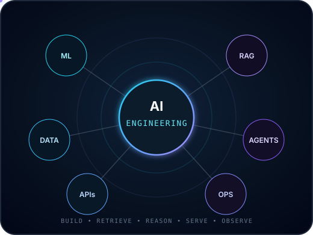
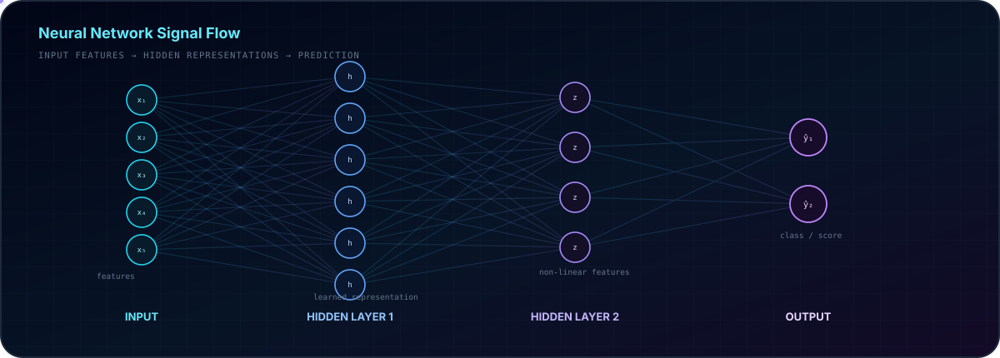
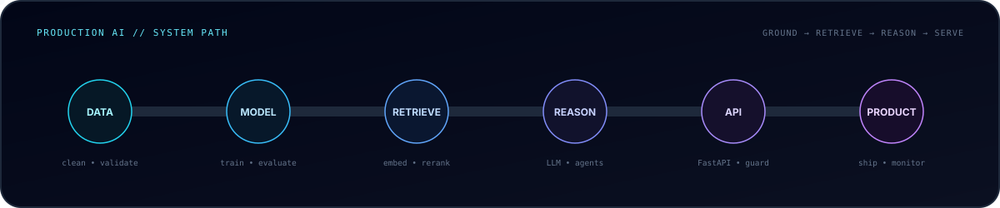
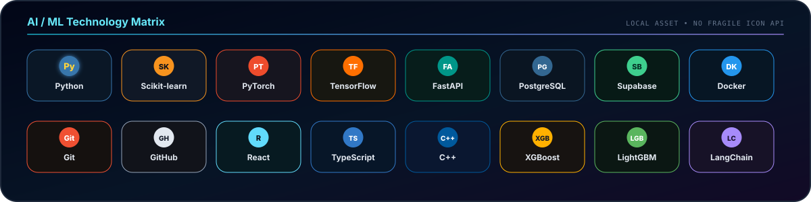
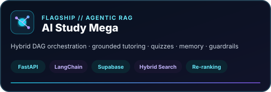
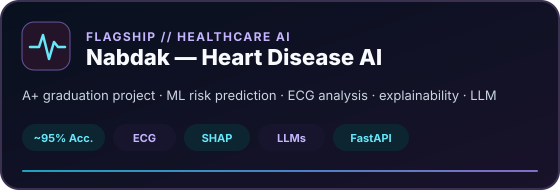
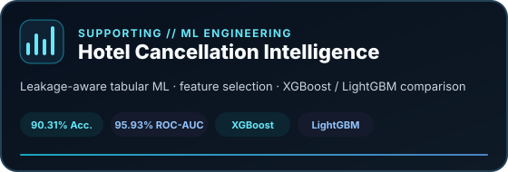
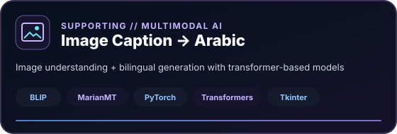
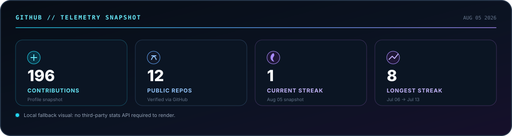
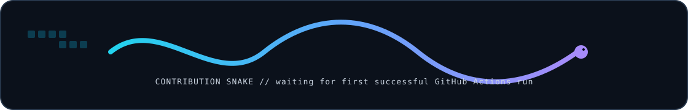

<p align="center">
  
</p>

<p align="center">
  <a href="https://portfolio-peach-eight-llk6zb6w8h.vercel.app/"></a>
  <a href="https://www.linkedin.com/in/omer-ahmed-bahaa/"></a>
  <a href="mailto:omarahmed545454@gmail.com"></a>
  <a href="https://codeforces.com/profile/OmarXDev"></a>
  
</p>

<p align="center">
  
</p>

---

<h2 align="center">AI Engineering Profile</h2>
<p align="center"><sub>Applied machine learning, deep learning, generative AI and production-minded software engineering</sub></p>

<table>
<tr>
<td width="58%" valign="top">

I'm **Omar Ahmed**, an **AI Engineer** and 2026 Computer Science / Information Technology graduate based in Alexandria, Egypt.

My work sits between **machine learning research thinking and production software engineering**. I care about the complete path from raw data and model experiments to APIs, retrieval systems, databases, evaluation, deployment and real product behavior.

```yaml
role: AI Engineer
core:
  - Machine Learning
  - Deep Learning
  - Generative AI
  - RAG & LLM Systems
  - Agentic AI
engineering:
  - FastAPI & REST APIs
  - PostgreSQL / Supabase
  - Vector Search & Re-ranking
  - Docker & Git
principle: "Build systems, not isolated notebooks."
```

**Background**
- DEPI — AI & Machine Learning training
- ITI — Generative AI internship
- Frontend engineering foundation with React/TypeScript
- ICPC Assistant Coach & competitive problem solving

</td>
<td width="42%" align="center" valign="middle">



</td>
</tr>
</table>

---

<h2 align="center">Machine Learning & Deep Learning</h2>
<p align="center"><sub>Classical ML, ensemble methods, neural networks, evaluation and explainability</sub></p>

<p align="center">
  
</p>

<table>
<tr>
<td width="33%" valign="top">
<h3 align="center">Classical ML</h3>

- Supervised learning
- Classification & regression
- Decision Trees & Random Forest
- CatBoost
- XGBoost
- LightGBM
- Feature selection
- Scikit-learn pipelines

</td>
<td width="33%" valign="top">
<h3 align="center">Deep Learning</h3>

- Artificial Neural Networks
- Convolutional Neural Networks
- Computer Vision
- Natural Language Processing
- Transformers
- PyTorch
- TensorFlow / Keras
- BLIP-based vision-language workflows

</td>
<td width="33%" valign="top">
<h3 align="center">Evaluation & Explainability</h3>

- Train/test isolation
- Accuracy, Precision & Recall
- F1-Score
- ROC-AUC
- Cross-validation
- Optuna tuning
- SHAP explainability
- Error analysis

</td>
</tr>
</table>

<p align="center">
  
</p>

<p align="center"><sub>My goal is not just to fit a model — it is to understand the data, prevent leakage, compare baselines, tune responsibly, explain predictions and connect model quality to the real problem.</sub></p>

---

<h2 align="center">Production AI Architecture</h2>
<p align="center"><sub>Where models become reliable systems</sub></p>

<p align="center">
  
</p>

<p align="center"><sub>I care about retrieval quality, orchestration, API boundaries, databases, guardrails, observability, deployment, scalability and maintainability around the model.</sub></p>

---

<h2 align="center">AI / ML Technology Stack</h2>
<p align="center"><sub>A focused toolkit for model development, intelligent backends and product integration</sub></p>

<p align="center">
  
</p>

<table>
<tr><td><b>Machine Learning</b></td><td>Scikit-learn · CatBoost · XGBoost · LightGBM · Feature Selection · Optuna · SHAP</td></tr>
<tr><td><b>Deep Learning</b></td><td>PyTorch · TensorFlow · Keras · ANN · CNN · NLP · Computer Vision · Transformers</td></tr>
<tr><td><b>Generative AI</b></td><td>LangChain · LLM Applications · RAG · Agentic AI · Embeddings · Vector Search · Re-ranking · Prompt Engineering</td></tr>
<tr><td><b>Backend & Data</b></td><td>FastAPI · REST APIs · PostgreSQL · Supabase · Vector Databases</td></tr>
<tr><td><b>Software & Web</b></td><td>React · TypeScript · JavaScript · HTML/CSS · Tailwind CSS</td></tr>
<tr><td><b>Engineering Tools</b></td><td>Git · Docker · VS Code · API Design · Production-minded Architecture</td></tr>
<tr><td><b>Problem Solving</b></td><td>C++ · Java · Algorithms · Data Structures · Competitive Programming</td></tr>
</table>

---

<h2 align="center">Flagship AI & ML Systems</h2>
<p align="center"><sub>Projects selected to show model depth, system design and end-to-end engineering</sub></p>

<table>
<tr>
<td width="50%" valign="top">
<h3 align="center">🧠 Agentic RAG EDU</h3>
<p align="center"><b>AI-Powered Study Platform</b></p>
<p>Production-oriented educational AI system for grounded tutoring, summaries, quiz generation and personalized study workflows.</p>
<p><b>Architecture:</b> Hybrid DAG orchestration · FastAPI-separated AI layer · Supabase · Hybrid Search · Re-ranking · Memory · Guardrails · RAG</p>
<p align="center"><a href="https://github.com/omarbazooka/AI-Study-Mega"><b>Repository</b></a> · <a href="https://front-end-production-1b93.up.railway.app/"><b>Live Demo</b></a></p>
</td>
<td width="50%" valign="top">
<h3 align="center">❤️ Nabdak</h3>
<p align="center"><b>Heart Disease AI Platform — Graduation Project (A+)</b></p>
<p>Led an 8-member graduation team and owned the AI track across structured-data ML, ECG analysis, explainability and LLM-assisted output.</p>
<p><b>ML signal:</b> clinical-feature prediction · ~95% evaluated accuracy · model comparison · explainability · ECG workflow · LLM layer · FastAPI</p>
<p align="center"><a href="https://github.com/omarbazooka/heart-disease-prediction"><b>Repository</b></a> · <a href="https://heart-disease-prediction-kohl.vercel.app/heart"><b>Live Demo</b></a></p>
</td>
</tr>
<tr>
<td width="50%" valign="top">
<h3 align="center">📊 Hotel Cancellation Intelligence</h3>
<p align="center"><b>Leakage-Aware Tabular Machine Learning</b></p>
<p>Comparison of XGBoost and LightGBM with and without L1-based feature selection inside structured preprocessing pipelines.</p>
<p><b>Results:</b> 90.31% best accuracy · 95.93% best ROC-AUC · train/test isolation · multi-metric evaluation</p>
<p align="center"><a href="https://github.com/omarbazooka/Final-Hotel-Reservation-Project"><b>Repository</b></a></p>
</td>
<td width="50%" valign="top">
<h3 align="center">🖼️ Image Caption → Arabic</h3>
<p align="center"><b>Vision-Language + Translation Pipeline</b></p>
<p>Desktop AI application that generates English image descriptions with BLIP and translates them to Arabic with MarianMT.</p>
<p><b>Pipeline:</b> Image → BLIP → English Caption → MarianMT → Arabic Translation → Tkinter UI</p>
<p align="center"><a href="https://github.com/omarbazooka/Image-Caption-Generator-with-Arabic-Translation-"><b>Repository</b></a></p>
</td>
</tr>
</table>

<h3 align="center">Project Cards</h3>

<p align="center">
  <a href="https://github.com/omarbazooka/AI-Study-Mega"></a>
  <a href="https://github.com/omarbazooka/heart-disease-prediction"></a>
</p>
<p align="center">
  <a href="https://github.com/omarbazooka/Final-Hotel-Reservation-Project"></a>
  <a href="https://github.com/omarbazooka/Image-Caption-Generator-with-Arabic-Translation-"></a>
</p>

---

<h2 align="center">GitHub Activity</h2>
<p align="center"><sub>Engineering activity without making third-party widgets the center of the profile</sub></p>

<p align="center">
  
</p>

<p align="center">
  
</p>

---

<h2 align="center">Contribution Stream</h2>

<p align="center">
  
</p>

<sub>The repository keeps a local fallback so this section never appears as a broken image. The workflow can replace it with the live contribution snake.</sub>

---

<h2 align="center">Experience</h2>

```text
2025.11 → 2026.07   Digital Egypt Pioneers Initiative (DEPI)   AI & Machine Learning Trainee
2025.08 → 2025.09   Information Technology Institute (ITI)     Generative AI Intern
2024.10 → 2025.05   DEPI / New Horizons                        Software Development / Frontend
2025.10 → 2026.03   Egyptian E-Learning University             ICPC Assistant Coach
```

<p align="center">Selected credentials: <b>Huawei HCIA-AI</b> · <b>Information Technology Specialist in Artificial Intelligence</b> · <b>React Frontend Web Developer</b> · <b>Building LLM Applications with Prompt Engineering</b></p>

---

<h2 align="center">Current Engineering Focus</h2>
<p align="center"><sub>Building proof across products, business impact and technical depth</sub></p>

<table>
<tr>
<td width="33%" align="center"><b>END-TO-END AI</b><br/><br/><sub>Deployed systems that behave like products, not isolated notebooks.</sub></td>
<td width="33%" align="center"><b>BUSINESS IMPACT ML</b><br/><br/><sub>Connect model decisions to operational value, cost and ROI.</sub></td>
<td width="33%" align="center"><b>ADVANCED ML</b><br/><br/><sub>Stronger mathematical depth, experimentation, benchmarking and Kaggle work.</sub></td>
</tr>
</table>

I'm also deepening the **MLOps / DevOps** side of AI engineering: reproducibility, deployment, monitoring, evaluation, maintainability and scalable system design.

**In development:** `VentureMind AI` — a multi-agent system for business-idea analysis, competitor research and feasibility-report generation.

---

<h2 align="center">Connect</h2>
<p align="center"><b>Machine Learning · Applied AI · RAG / LLM Systems · Agentic Products</b></p>

<p align="center">
  <a href="https://portfolio-peach-eight-llk6zb6w8h.vercel.app/"></a>
  <a href="https://www.linkedin.com/in/omer-ahmed-bahaa/"></a>
  <a href="mailto:omarahmed545454@gmail.com"></a>
</p>

<p align="center">
  
</p>